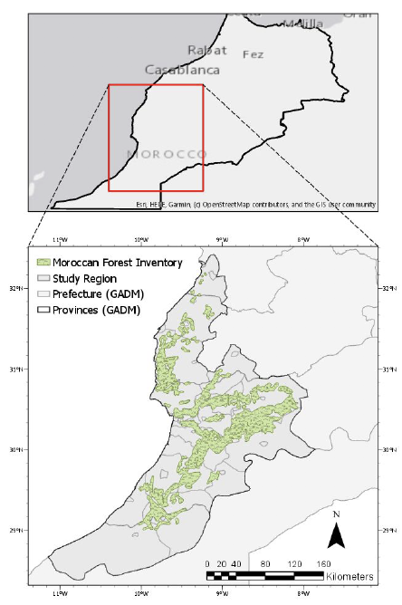
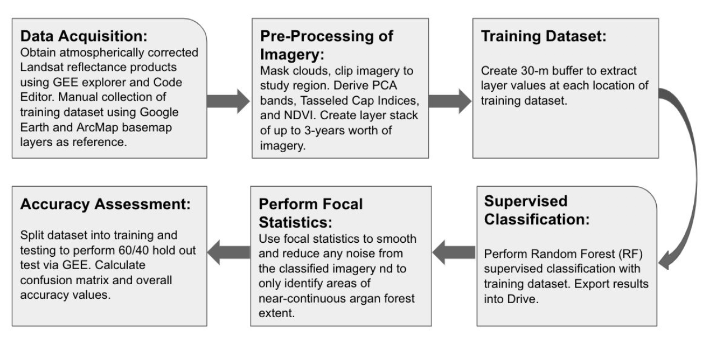
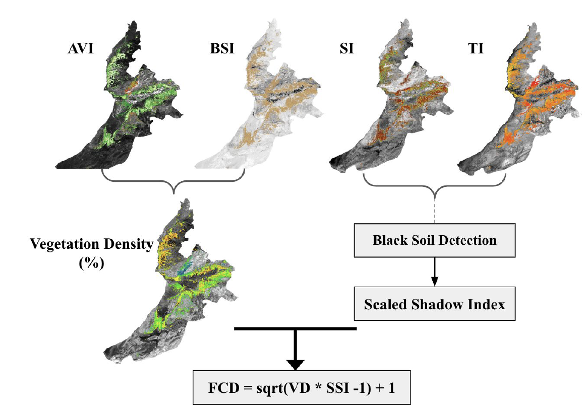
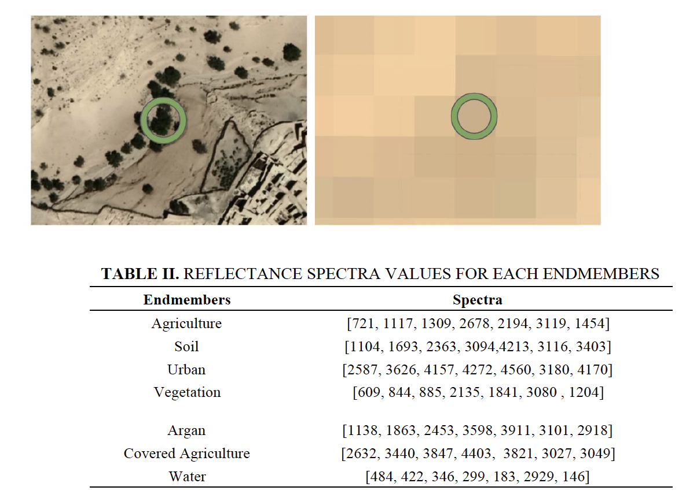
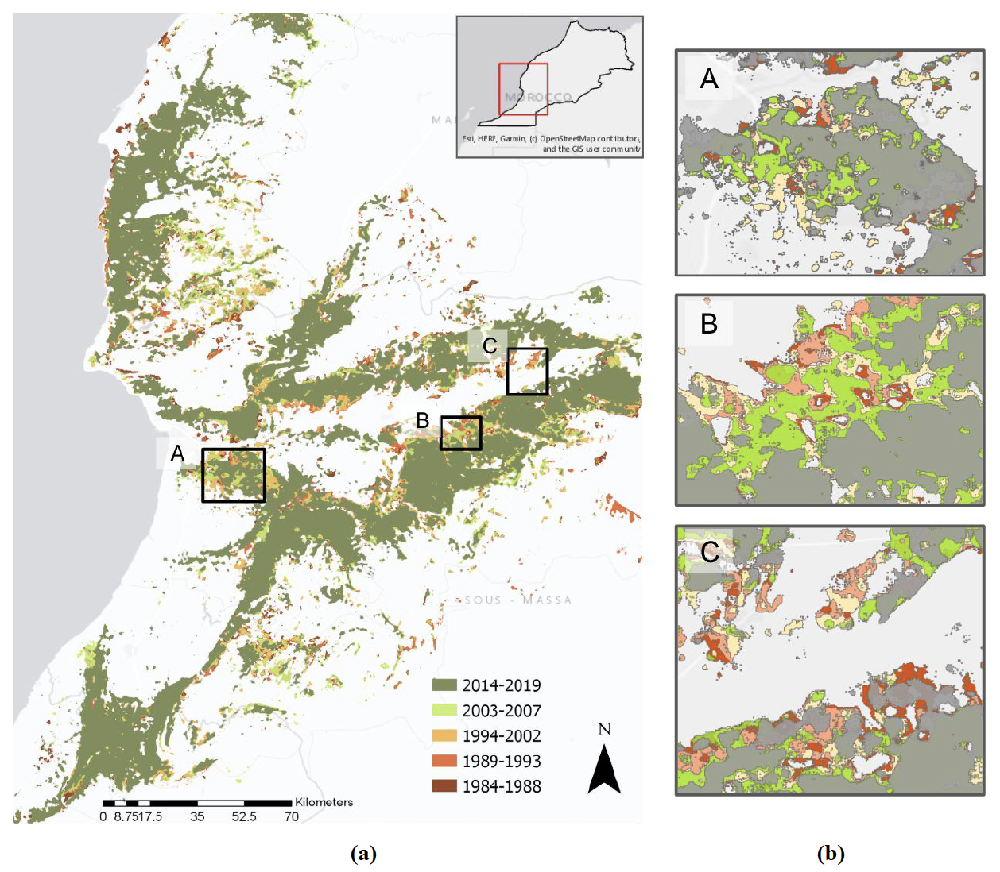
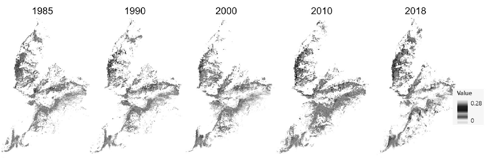
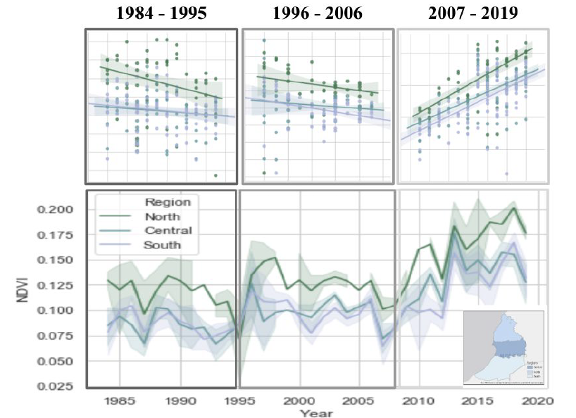
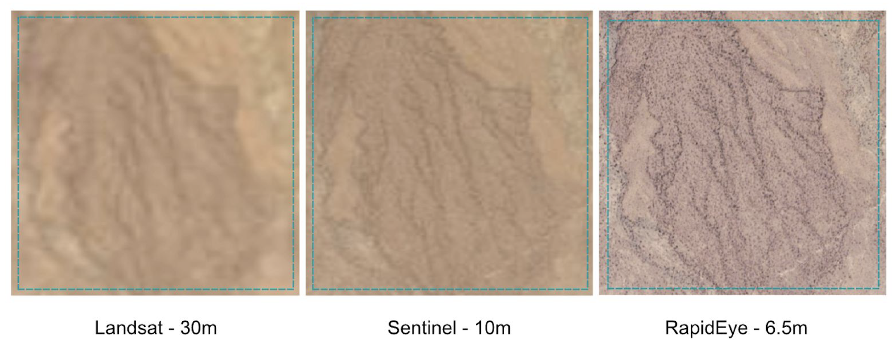

# Satellite-based detection of Tree Species Argania spinosa in Morocco from 1984 to 2018 using Random Forest Supervised Classification

## Table of Contents  
- [Project Description](#project-Description)  
- [Study Region](#study-region) 
- [Methods](#methods)  
- [Key Findings](#key-findings) 
- [Challenges](#challenges-&-future-work)

## Project Description 
Following the commodification of its extracted oil, there has been a rapid appreciation of argan prices in the 1990’s. Likewise, an increased conservation effort in the management of the natural resources has been implemented within the region (Lybbert et al., 2011). A widespread interest in the
sustained health of the argan forest, coupled with incentives for poverty alleviation of the Berber people in sourthwestern Morocco has been prevalent between various stakeholders. Considering that the Argania spinosa species is endemic to Morocco and the dominant role argan forests play in sustaining the livelihoods of rural households (e.g. grazing, timber harvesting) it is imperative to monitor the historical and present day extent of the forest. Therefore, this study aims (1) to quantify the extent of argan forest using a pixel-based supervised Random Forest classification approach and (2) measure the argan forest canopy density through various techniques and vegetation indices throughout 1984 and 2018. By identifying trends seen in multi-decadal timescales, such data and analysis can help aid in understanding the regional land-use land-cover change (LULC) as it pertains to the argan forest and climate, as well as anthropogenic factors that determine its longevity.

## Study Region 
The argan forest extent in 1994, as determined by the
Morrocan forest inventory, was used as the primary ground-truth
and reference data during the collection of the training dataset
(Fig. 1). Unlike various other vegetation types in the region such as certain grassess and shrubs, argan tree presence is typically fixed unless external drivers such as overgrazing, logging, and/or intense climatic stressors are acted upon the forest community.

<figure class="image">
  
  <figcaption>Figure 1. Depiction of the study area which includes prefectures: Doukkala - Abda, Marrakech - Tensift - Al Haouz, Souss - Massa - Draâ, and Guelmim - Es-Semara according to GADM source. The perimeter shaded in green is the Morocan forest inventory data, which shows the extent of the surveyed argan forest in 1994.</figcaption>
</figure>

Although this inventory data is a good indicator of where argan
forests can be found, there have been instances where mature
argan forests were found outside of this predetermined boundary,
typically in close-proximity to the perimeter.

## Methods 

<figure class="image">
  
  <figcaption>Figure 2. Flow chart for supervised Random Forest classification: (1) data acquisition (2) pre-processing (3) supervised classification (4) post-processing (5) accuracy assessments. </figcaption>
</figure>

### Forest Canopy Density (FCD)
<figure class="image">
  
  <figcaption>Figure 3. Shows the equations used to derive the three indices including Advanced Vegetation Index (AVI), Bare Soil Index (BI), Canopy Shadow Index (SI), and the Thermal band used as inputs into deriving the Forest Canopy Density (FCD). </figcaption>
</figure>

### Linear Spectral Unmixing

Monitoring vegetation and land use changes in arid and semi-arid regions have presented difficulties due to the sparse distribution of plants grown here. There are significant limitations when using conventional image-processing methods where challenges arise when trying to quantify vegetation cover of less than 40%, due to the spectral dominance of background soils (Smith et al 1990).

For the purposes of the study, we remotely collected the spectra values from areas where endmembers are present via GEE. A total of 7 endmember spectra including agriculture, soil, urban, vegetation, argan, covered agriculture (high reflective sheets), and water.

<figure class="image">
  
  <figcaption>Figure 4. Sample spectra collected from the Landsat TM imagery from Google Earth Engine, using the inspection tool. The drastic difference between the high resolution imagery and Landsat can offer an idea of how argan canopies are represented on a per-pixel basis. </figcaption>
</figure>

## Key Findings 

<figure class="image">
  
  <figcaption>Figure 5.(a) Visualization of classified argan extent from 1984 to 2019 at varying degrees of temporal grouping. The darker olive green areas indicate the most recent argan extent, while darker red areas signify the earliest extent in the late 1980’s. (b) Sample locations used to identify ‘high risk’ areas that showed shrinkage in extent. </figcaption>
</figure>

<figure class="image">
  
  <figcaption>Figure 6. Illustration of argan forest extent progression in the years 1985, 1990, 2000, 2010, and 2018. The NDVI values range from 0 to 0.28. </figcaption>
</figure>

<figure class="image">
  
  <figcaption>Figure 7. Time-series of NDVI values based on each region (i.e. North, Central, South) at classified argan extents within the dry-season between July and September. The shaded areas represent the variation between the average NDVI values within these months. Increase in NDVI values may be attributed to increased agricultural expansion in the region. </figcaption>
</figure>

## Challenges & Future Work

<figure class="image">
  
  <figcaption>S1. Depiction of three different satellites and their contrasting spatial resolution. </figcaption>
</figure>

Following the preliminary findings, we identify a number of criteria that require further investigation to reduce the overall uncertainty of our results. Improvements in either the method and/or the quality of the training data can help to increase accuracy of the classification. This can be done by
increasing sample areas with less ambiguity. Due to the coarse spatial resolution of the Landsat series, distinguishing a single tree (roughly <7m in diameter) can be challenging when there are mixed land-covers that are present in a pixel. If we can restrict sampling to areas with completely barren land with majority argan tree canopy, as opposed to shrub/grass/ag-lands we can reduce noise in the classification. However, doing so will substantially underestimate the argan extent, while increasing confidence. Currently, it seems like areas of barren and agricultural lands have been included in the argan extent classification and this rigidity in sampling can theoretically help to reduce this.

Additional improvements can be made in the classification when we use higher-resolution hyperspectral imagery (<5m) such as, or even multispectral Sentinel with 10m resolution. An object-based classification approach, best suited for imagery ~1m resolutions will be data intensive, but worthwhile in identifying argan tree conditions per tree basis. Detection of individual trees
based primarily on the shape and height, which can be very advantageous in differentiating between argan and other vegetation types with different canopy structure. 

Similarly, generalized height data products can also allow for the thresholding of classification areas to filter out short or stubbier vegetation such as shrubs and taller trees such as palms (e.g. Global Height Canopy 2005). Using a hyperspectral sensor can also help differentiate between species-types, including vegetation with similar spectral properties as argan. Further datasets which may help are meteorological/biophysical data to help distinguish between regions that are optimal for argan growth, which can in turn aid in argan forest predictions based on future climatic scenarios. 

Finally, ground-truth verification data identifying argan tree presence across additional years can also help to perform statistical accuracy analysis, aiding to validate the model, while theoretically increase the overall classification accuracy.